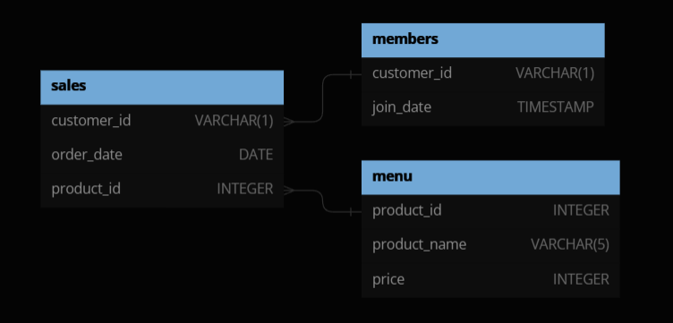
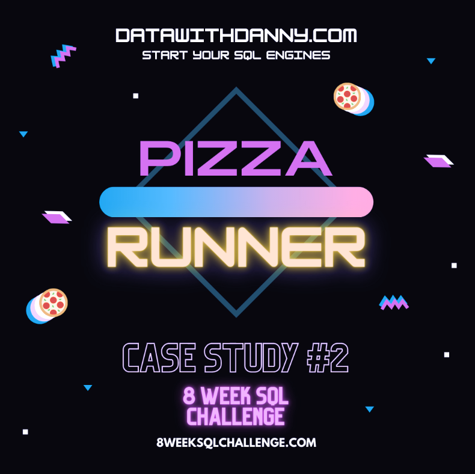

# 8 weeks SQL challenge
Reto de 8 semanas para aprender y mejorar habilidades de querying en SQL, a traves de soluciones a ocho casos de estudio.

El reto y los casos de estudio que se desarrollan en este repositorio pertenecen al challenge de [Data with Dany](https://www.datawithdanny.com/) y su reto [8weekSQLchallenge](https://8weeksqlchallenge.com/getting-started/) que forma parte de su curso [Serious SQL](https://www.datawithdanny.com/courses/serious-sql).

A lo largo de las 8 semanas que dura el reto, me comprometo a:
- Practicar SQL en: `MySQL`
- Resolver cada caso de estudio.
- Documentar los resultados como parte de mi portafolio.

## Week 1: [Danny's Diner](https://8weeksqlchallenge.com/case-study-1/)

  

<h3 align="center"> Descripción </h3>
En este caso de estudio se nos presenta un restaurante llamado `Danny's Diner`, cuentan con una base de datos para el registro de clientes, ventas y los platillos que conforman el menu.

Por medio de los datos que almacenados en la base de datos `dannys_diner` se quiere responder a una serie de preguntas sobre los clientes, sus visitas al restaurante, cuanto dinero gastan en el y cual de los platillos del menu es el favorito de los consumidores.

El objetivo es responder cada pregunta por medio de queries de SQL en busca de insights que ayuden a Dany a mejorar y personailizar la experiencia de usuario, a su vez crear mejores programas de recompensas para sus clientes más fieles.

Dany provee 3 tablas clave para responder todas y cada una de las preguntas de negocio:
- `sales`
- `menu`
- `members`'

 

[Solución de la semana #1](./week-1/Dannys_diner.md)

## Week 2: [Pizza Runner](https://8weeksqlchallenge.com/case-study-2/)

  

<h3 align="center"> Descripción </h3>

**Pizza Runner** es una pizzeria que cuenta con un sistema de delivery por medio de una aplicación, donde sus clientes pueden ordenar cualquiera de sus pizzas del menu y agregar o quitar ingredientes, a su vez cada orden es asignada a alguno de sus repartidores llamados "runners".

En este caso de estudio se nos proporciona una base de datos relacional con los datos correspondinetes a las ordenes de clientes, ordenes asignadas a cada repartidor, tipos de pizza, etc. Sin embargo algunas tablas requieren de limpieza y formateo de los datos para poder crear las queries y generar cálculos.

El objetivo responder a las preguntas del caso de estudio, limpiar los datos y analizarlos. En esta ocasión tenemos muchas más preguntas que responder, se categorizan de la siguiente manera:
- Pizza Metrics
- Runner and Customer Experience
- Ingredient Optimisation
- Pricing and Ratings
- Bonus DML Challenges (DML = Data Manipulation Language)

La base de datos `pizza_runner ` se compone de las siguinetes tablas
- `runners`
- `customer_orders`
- `runner_orders`
- `pizza_names`
- `pizza_recipes`
- `pizza_toppings`

 