# Danny's Diner

Base de datos: `dannys_diner`  
Tablas: 
- `sales`: Registro de ventas, columnas: `customer_id`, `order_date` y `product_id`. 
- `menu`: Lista de platillos/productos, columnas: `product_id`, `product_name` y `price`.
- `members`: Registro de clientes, columnas: `customer_id` y `join_date`.

## Diagrama Entidad Relación

## Preguntas
El código SQL que responde a todas las preguntas de este caso de estudio estan en ell archivo [dannys_diner_questions.sql](./dannys_diner_questions.sql)

📢 Las preguntas del caso de estudio son copia y pega del recurso original, por lo tanto estaran en inglés.

1. What is the total amount each customer spent at the restaurant?  
**Resultado**: El cliente A es el mayor consumidor con un total gastado de $76 USD.

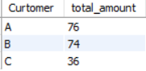

2. How many days has each customer visited the restaurant?  
**Resultado**: Con 6 dias en total, el cliente B es quien tiene mayor cantidad de visitas. Mientras que el cliente A tiene 4 y el cliente C tiene 2 visitas registradas.

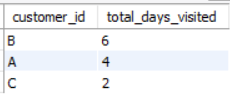

3. What was the first item from the menu purchased by each customer?  
**Resultado**: En el caso del cliente A su primier compra fue de 2 platillos distintos, sushi y curry.

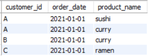

4. What is the most purchased item on the menu and how many times was it purchased by all customers?  
**Resultado**: Ramen es el producto más vendido del menú con un total de 8 ventas en total.

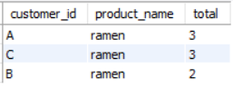

5. Which item was the most popular for each customer?  
**Resultado**: Para los clientes A y C el producto/platillo más popular es el ramen, sin embargo B a comprado por igual los 3 distintos platillos del menu.

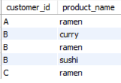

6. Which item was purchased first by the customer after they became a member?  
**Resultado**: El primer platillo que compró el cliente A fue Ramen y B compró Sushi.

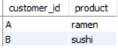

7. Which item was purchased just before the customer became a member?  
**Resultado**: Antes de convertirse en miembros de Danny's Diner, el cliente B compró Curry, mientras que el cliente A compro tanto Curry como Sushi en una misma orden.

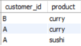

8. What is the total items and amount spent for each member before they became a member?  
**Resultado**: Antes de convertirse en miembros del restaurante, B compró 3 platillos y gastó en total de $40 USD, y A compró 2 platillos gastando un total de $25 USD

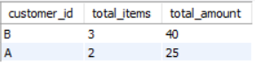

9. If each $1 spent equates to 10 points and sushi has a 2x points multiplier - how many points would each customer have?  
**Resultado**: Total de puntos por cliente registrado: B es el que mayor cantidad de punto a acumulado con 940, y A solo 860.

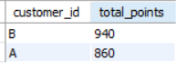

10. In the first week after a customer joins the program (including their join date) they earn 2x points on all items, not just sushi - how many points do customer A and B have at the end of January?  
**Resultado**: Durante la primer semana despues de registrarse como cliente en Danyn's Diner el cliente A realizó más compras por lo cuál logró acumular un total de 1,370 puntos, en cambio B solo consiguió 940.

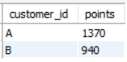

## Bonus
**Descripción**:  
The following questions are related creating basic data tables that Danny and his team can use to quickly derive insights without needing to join the underlying tables using SQL.

### Bonus #1

  Recreate the following table output using the available data:

  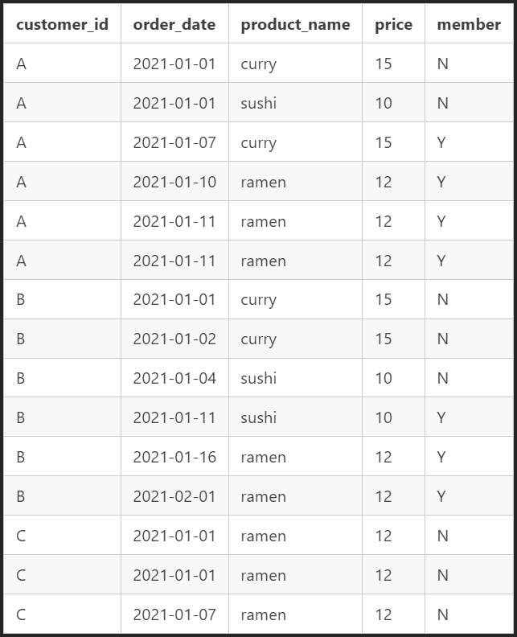

**Resultado**: La tabla muenstra la relación de clientes y sus comprar realizadas, con un marcador de si era o no miembro del restaurante al momento de realizar la compra, donde:
- Y = El cliente registrado al momento de la compra
- N = El cliente no registrado al momento de la compra.

La tabla resultante se encampsuló en una vista llamada `vsales`.  
<code> SELECT * FROM vsales; </code>

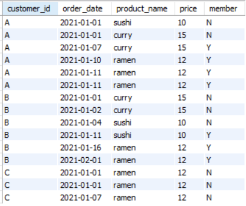
 

### Bonus #2
**Descripción**: Danny also requires further information about the `ranking` of customer products, but he purposely does not need the `ranking` for non-member purchases so he expects null ranking values for the records when customers are not yet part of the loyalty program.

La tabla resultante se encampsuló en una vista llamada `vRanking`.  
<code> SELECT * FROM vRanking; </code>

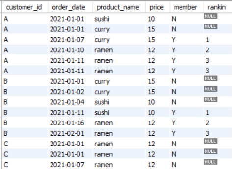

### Conclusión
A lo largo del primer caso de estudio `Danny's Diner` se aplicaron los siguientes elementos de querying:
- Unión de tablas con `INNER JOIN` y `LEFT JOIN`.
- Agrupamiento con `GROUP BY`.
- Ordenamiento con `ORDER BY`.
- Sub queries dando paso a tablas virtuales para incluirlas a otras tablas fisicas por medio de `JOINS`.