# Danny's Diner

Base de datos: `pizza_runner`  
Tablas: 
- `runners`: Catálogo de repartidores.
- `customer_orders` Ordenes de los clientes.
- `runner_orders` Ordenes asignadas a los repartidores.
- `pizza_names`: Catálogo de pizzas.
- `pizza_recipes`: Recetas de las pizzas.
- `pizza_toppings`: Catálogo de toppings que pueden incluirse en las recetas de cada pizza.

[Script para crear y llenar las tablas](./CREATED_DB_TABLES.sql)

## Diagrama Entidad Relación

## Estandarización
En el [script inicial](./CREATED_DB_TABLES.sql) algunos los datos que se nos proporcionan tienen discrepancias como valores vacíos y "null" (si, tal cual en texto), o bien el tipo de dato de algunas columnas no concuerda con el valor que almacenan y que se requiere para una buena eficiencia en la ingesta y consulta de datos.

La estandarización se aplicó a las tablas `customer_orders` y `runner_orders`, con el objetivo de no trabajar con valores vacíos o incorrectos para evitar futuros inconvenientes en el querying, así como establecer un correcto tipado en columnas que manejan fechas y valores numéricos, de esta forma podremos aplicar calculos matemáticos como sumas, restas, promedios, etc.

**Limpieza de valores**:
<table>
  <thead>
    <th>
      Tabla
    </th>
    <th>
      Columna
    </th>
    <th>
      Valores Anteriores
    </th>
    <th>
      Valores Nuevos
    </th>
  </thead>
  <tbody>
    <tr>
      <td  rowspan="2">
        customer_orders
      </td>
      <td>
        exclusions
      </td>
      <td>
        " ", "null"
      </td>
      <td>
        NULL
      </td>
    </tr>
    <tr>
      <td>
        extras
      </td>
      <td>
        " ", "null"
      </td>
      <td>
        NULL
      </td>
    </tr>
    <tr>
      <td  rowspan="4">
        runner_orders
      </td>
      <td>
        pickup_time
      </td>
      <td>
        " ", "null"
      </td>
      <td>
        NULL
      </td>
    </tr>
    <tr>
      <td>
        duration
      </td>
      <td>
        " ", "null"
      </td>
      <td>
        NULL
      </td>
    </tr>
    <tr>
      <td>
        distance
      </td>
      <td>
        " ", "null"
      </td>
      <td>
        NULL
      </td>
    </tr>
    <tr>
      <td>
        cancelation
      </td>
      <td>
        " ", "null"
      </td>
      <td>
        NULL
      </td>
    </tr>
  </tbody>
</table>

**Estandarización**:

📢 Importante tener en cuenta que las unidades de medida para la distancia (`distance`) y la duración (`duration`) son kilometros (`km`) y minutos (`min`) respectivamente.

<table>
  <thead>
    <th>
      Tabla
    </th>
    <th>
      Columna
    </th>
    <th>
      Valor Anterior
    </th>
    <th>
      Valor Nuevo
    </th>
  </thead>

  <tbody>
    <tr>
      <td  rowspan="2">
        runner_orders
      </td>
      <td>
        duration
      </td>
      <td>
        "mins", "minutes", "minute"
      </td>
      <td>
        (vacío)
      </td>
    </tr>
    <tr>
      <td>
        distance
      </td>
      <td>
        "km", " km"
      </td>
      <td>
        (vacío)
      </td>
    </tr>
  </tbody>
</table>

**Corrección de tipado**:
<table>
  <thead>
    <th>
      Tabla
    </th>
    <th>
      Columna
    </th>
    <th>
      Tipado Anterior
    </th>
    <th>
      Tipado Nuevos
    </th>
  </thead>

  <tbody>
    <tr>
      <td  rowspan="3">
        runner_orders
      </td>
      <td>
        pickup_time
      </td>
      <td>
        VARCHAR(19)
      </td>
      <td>
        DATETIME
      </td>
    </tr>
    <tr>
      <td>
        duration
      </td>
      <td>
        VARCHAR(10)
      </td>
      <td>
        FLOAT
      </td>
    </tr>
    <tr>
      <td>
        distance
      </td>
      <td>
        VARCHAR(7)
      </td>
      <td>
        INTEGER
      </td>
    </tr>
  </tbody>
</table>

## Preguntas
Este caso de estudio divide las preguntas por categoría.
- Pizza Metrics
- Runner and Customer Experience
- Ingredient Optimisation
- Pricing and Ratings
- Bonus DML Challenges (DML = Data Manipulation Language)

### Pizza Metrics 📊
El código SQL que responde a todas las preguntas de esta categoría estan en el archivo [pizza_runner_questions_metrics.sql](./pizza_runner_questions_metrics.sql)

1. How many pizzas were ordered?  
**Resultado**: 14 Pizzas ha sido ordenadas por los clientes de pizza runner. 
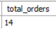

2. How many unique customer orders were made?  
**Resultado**: De las 14 ordenes totales, 4 estan incluidas dentro las 10 ordnes unicas (1 orden tiene más de un producto). 
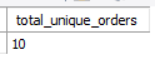

3. How many successful orders were delivered by each runner? 
**Resultado**: Repartidos 1 con 4 entregas es quien lleva la delantera en entregas satisfactorias.  
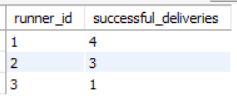

4. How many of each type of pizza was delivered? 
**Resultado**: 9 `Meatlovers` fueron entregadas, y solo 3 `Vegetarian`  
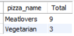

5. How many Vegetarian and Meatlovers were ordered by each customer?  
**Resultado**:  
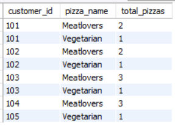

6. What was the maximum number of pizzas delivered in a single order?  
**Resultado**: En la orden número 4 se entregaron 3 pizzas, la mayor de todas las orden registradas.  
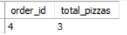

7. For each customer, how many delivered pizzas had at least 1 change and how many had no changes?  
**Resultado**: Solo el cliente 104 ha ordenado pizza con y sin cambios a en sus ordenes.  
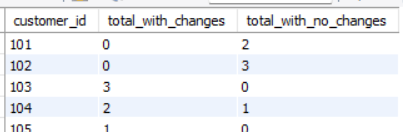

8. How many pizzas were delivered that had both exclusions and extras?  
**Resultado**: De las pizzas entregadas, solo una pizza tiene ambos cambios.  
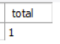

9. What was the total volume of pizzas ordered for each hour of the day?  
**Resultado**: Las 11:00 am y las 07:00 pm son los horarios con menor volumen de pizzas vendidas.  
La respuesta a esta pregunta la respondí con 2 formas distintas:  
    1. Calculando el volumen de pizzas vendidas solo en las horas registradas en la BBDD  
      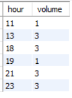
    2. Incluyendo las 24 horas del día, donde aquellas que no estan registradas en la BBDD marcan como volumen en 0.  
      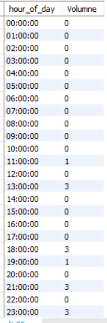

10. What was the volume of orders for each day of the week?  
**Resultado**: Los días con mayor volumen de pizza vendidas son Miercoles y Sabado.  
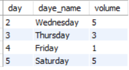

### Runner and Customer Experience 🏍️
1. How many runners signed up for each 1 week period? (i.e. week starts 2021-01-01)
2. What was the average time in minutes it took for each runner to arrive at the Pizza Runner HQ to pickup the order?
3. Is there any relationship between the number of pizzas and how long the order takes to prepare?
4. What was the average distance travelled for each customer?
5. What was the difference between the longest and shortest delivery times for all orders?
6. What was the average speed for each runner for each delivery and do you notice any trend for these values?
7. What is the successful delivery percentage for each runner?