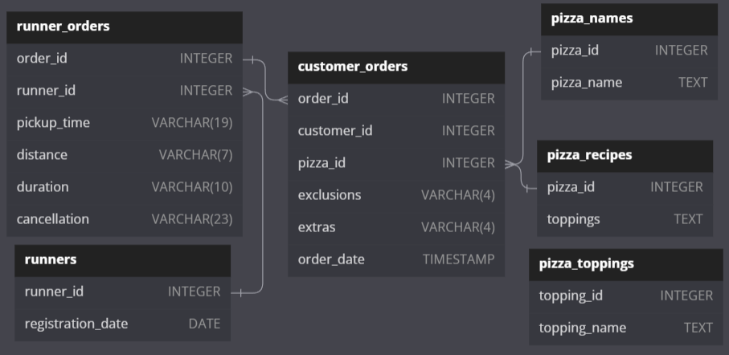

# Danny's Diner

Base de datos: `pizza_runner`  
Tablas: 
- `runners`: Catálogo de repartidores.
- `customer_orders` Ordenes de los clientes.
- `runner_orders` Ordenes asignadas a los repartidores.
- `pizza_names`: Catálogo de pizzas.
- `pizza_recipes`: Recetas de las pizzas.
- `pizza_toppings`: Catálogo de toppings que pueden incluirse en las recetas de cada pizza.

[Script para crear y llenar las tablas](./CREATED_DB_TABLES.sql)

## Diagrama Entidad Relación

## Estandarización
En el [script inicial](./CREATED_DB_TABLES.sql) algunos los datos que se nos proporcionan tienen discrepancias como valores vacíos y "null" (si, tal cual en texto), o bien el tipo de dato de algunas columnas no concuerda con el valor que almacenan y que se requiere para una buena eficiencia en la ingesta y consulta de datos.

La estandarización se aplicó a las tablas `customer_orders` y `runner_orders`, con el objetivo de no trabajar con valores vacíos o incorrectos para evitar futuros inconvenientes en el querying, así como establecer un correcto tipado en columnas que manejan fechas y valores numéricos, de esta forma podremos aplicar calculos matemáticos como sumas, restas, promedios, etc.

**Limpieza de valores**:
<table>
  <thead>
    <th>
      Tabla
    </th>
    <th>
      Columna
    </th>
    <th>
      Valores Anteriores
    </th>
    <th>
      Valores Nuevos
    </th>
  </thead>

  <tbody>
    <tr>
      <td  rowspan="2">
        customer_orders
      </td>
      <td>
        exclusions
      </td>
      <td>
        " ", "null"
      </td>
      <td>
        NULL
      </td>
    </tr>
    <tr>
      <td>
        extras
      </td>
      <td>
        " ", "null"
      </td>
      <td>
        NULL
      </td>
    </tr>
    <tr>
      <td  rowspan="4">
        runner_orders
      </td>
      <td>
        pickup_time
      </td>
      <td>
        " ", "null"
      </td>
      <td>
        NULL
      </td>
    </tr>
    <tr>
      <td>
        duration
      </td>
      <td>
        " ", "null"
      </td>
      <td>
        NULL
      </td>
    </tr>
    <tr>
      <td>
        distance
      </td>
      <td>
        " ", "null"
      </td>
      <td>
        NULL
      </td>
    </tr>
    <tr>
      <td>
        cancelation
      </td>
      <td>
        " ", "null"
      </td>
      <td>
        NULL
      </td>
    </tr>
  </tbody>
</table>

**Estandarización**:

📢 Importante tener en cuenta que las unidades de medida para la distancia (`distance`) y la duración (`duration`) son kilometros (`km`) y minutos (`min`) respectivamente.

<table>
  <thead>
    <th>
      Tabla
    </th>
    <th>
      Columna
    </th>
    <th>
      Valor Anterior
    </th>
    <th>
      Valor Nuevo
    </th>
  </thead>

  <tbody>
    <tr>
      <td  rowspan="2">
        runner_orders
      </td>
      <td>
        duration
      </td>
      <td>
        "mins", "minutes", "minute"
      </td>
      <td>
        (vacío)
      </td>
    </tr>
    <tr>
      <td>
        distance
      </td>
      <td>
        "km", " km"
      </td>
      <td>
        (vacío)
      </td>
    </tr>
  </tbody>
</table>

**Corrección de tipado**:
<table>
  <thead>
    <th>
      Tabla
    </th>
    <th>
      Columna
    </th>
    <th>
      Tipado Anterior
    </th>
    <th>
      Tipado Nuevos
    </th>
  </thead>

  <tbody>
    <tr>
      <td  rowspan="3">
        runner_orders
      </td>
      <td>
        pickup_time
      </td>
      <td>
        VARCHAR(19)
      </td>
      <td>
        DATETIME
      </td>
    </tr>
    <tr>
      <td>
        duration
      </td>
      <td>
        VARCHAR(10)
      </td>
      <td>
        FLOAT
      </td>
    </tr>
    <tr>
      <td>
        distance
      </td>
      <td>
        VARCHAR(7)
      </td>
      <td>
        INTEGER
      </td>
    </tr>
  </tbody>
</table>

## Preguntas
Este caso de estudio divide las preguntas por categoría.
- Pizza Metrics
- Runner and Customer Experience
- Ingredient Optimisation
- Pricing and Ratings
- Bonus DML Challenges (DML = Data Manipulation Language)

### Pizza Metrics 📊
El código SQL que responde a todas las preguntas de esta categoría estan en el archivo [pizza_runner_questions_metrics.sql](./pizza_runner_questions_metrics.sql)

1. How many pizzas were ordered?
2. How many unique customer orders were made?
3. How many successful orders were delivered by each runner?
4. How many of each type of pizza was delivered?
5. How many Vegetarian and Meatlovers were ordered by each customer?
6. What was the maximum number of pizzas delivered in a single order?
7. For each customer, how many delivered pizzas had at least 1 change and how many had no changes?
8. How many pizzas were delivered that had both exclusions and extras?
9. What was the total volume of pizzas ordered for each hour of the day?
10. What was the volume of orders for each day of the week?